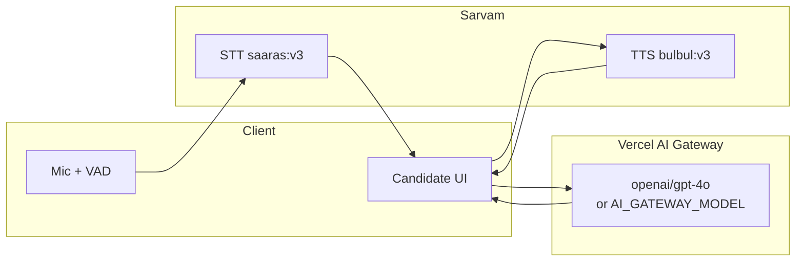
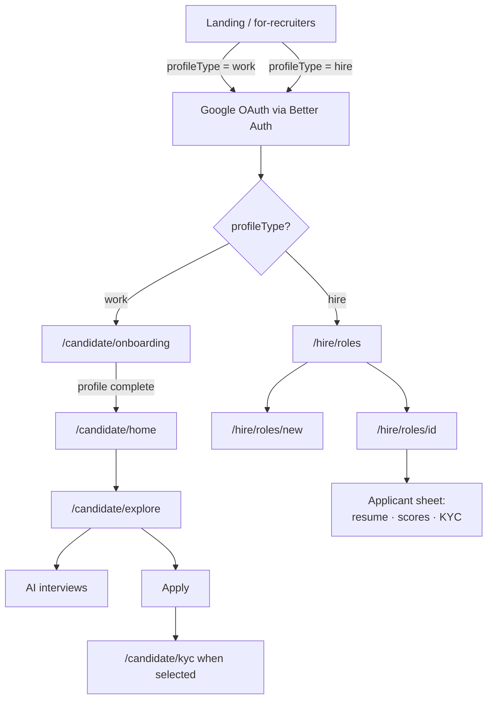
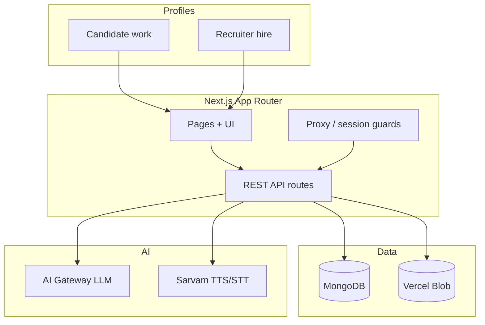
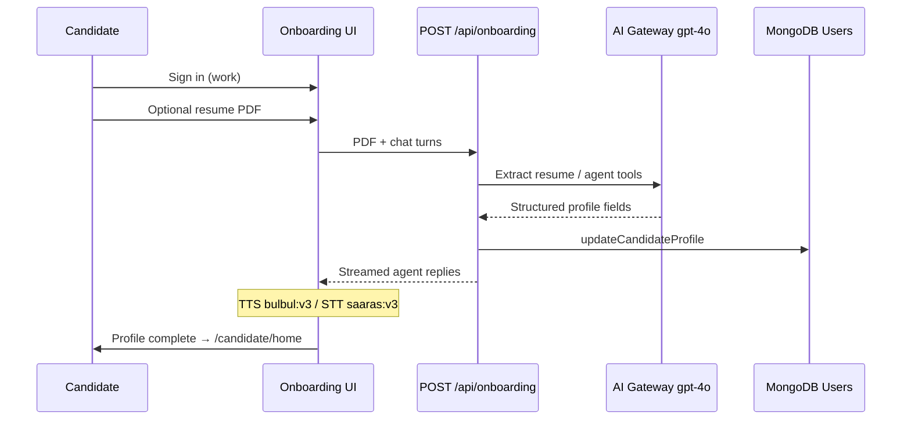
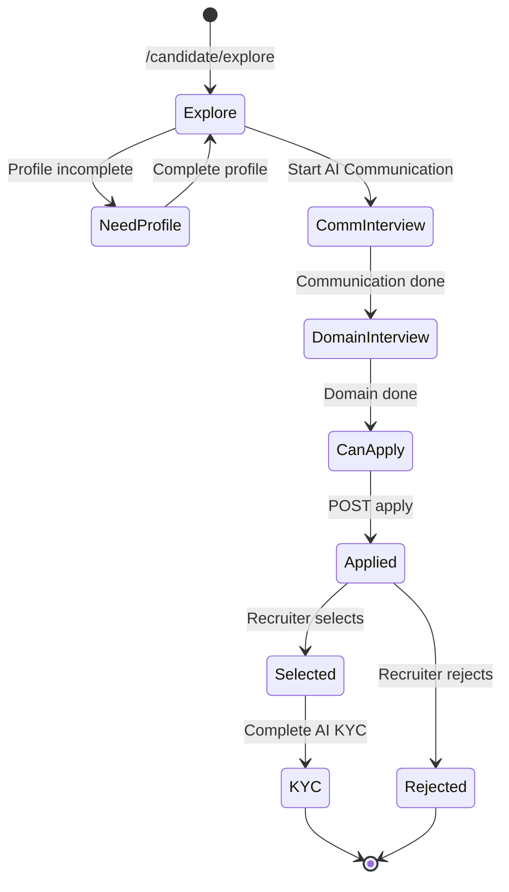
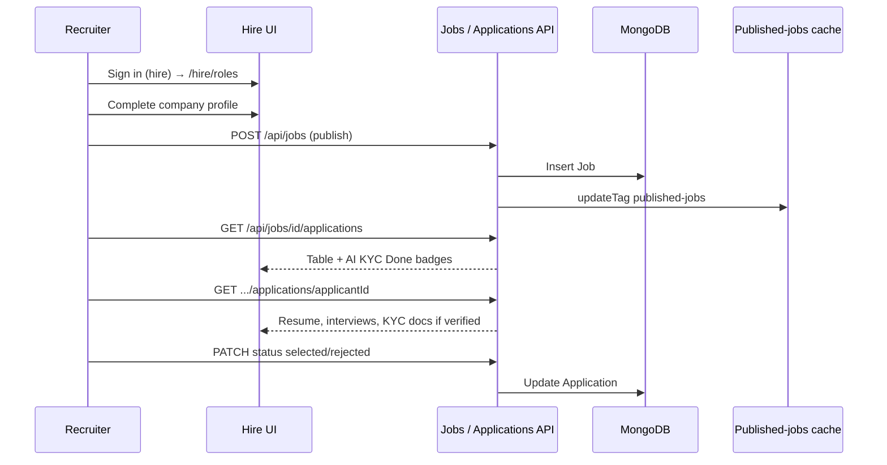
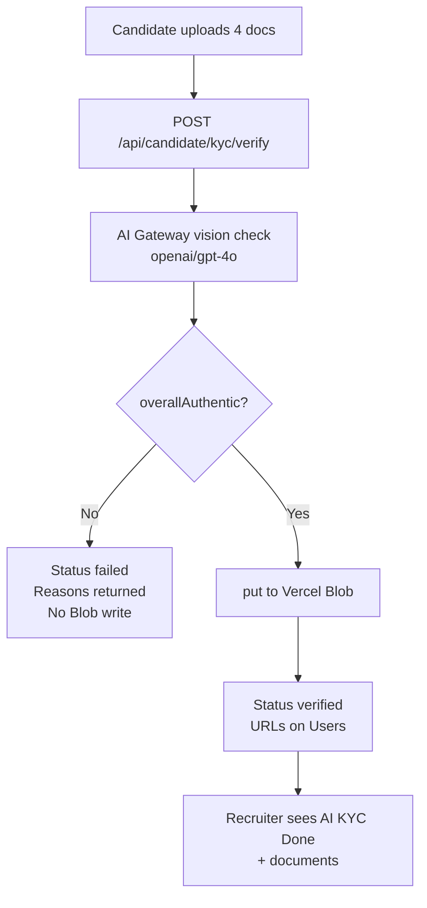
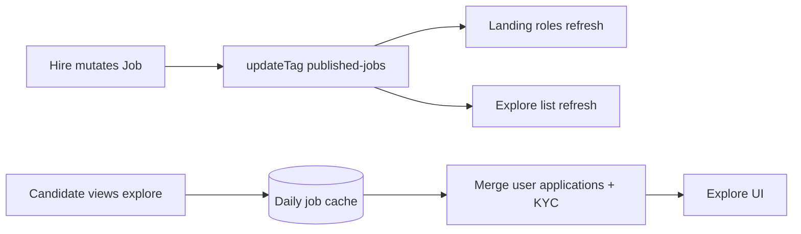

# BlueCollarz

**AI-native hiring infrastructure for candidates and recruiters.**

BlueCollarz connects skilled people with hiring teams through AI onboarding, resume building, communication & domain interviews, and KYC document checks — so recruiters get clearer signal, faster.

| | |
|---|---|
| **Candidates (`work`)** | Onboard, build a profile, explore roles, complete AI interviews, verify identity |
| **Recruiters (`hire`)** | Post roles, review scored applicants, select/reject, view verified KYC docs |
| **Auth** | [Better Auth](https://www.better-auth.com/) + Google OAuth |
| **AI** | Vercel AI Gateway (default `openai/gpt-4o`) + Sarvam voice (TTS/STT) |

---

## Table of contents

- [Capabilities](#capabilities)
- [Models used per feature](#models-used-per-feature)
- [Profiles & points of view](#profiles--points-of-view)
- [System overview](#system-overview)
- [Candidate flows](#candidate-flows)
- [Recruiter flows](#recruiter-flows)
- [KYC verification](#kyc-verification)
- [Caching & performance](#caching--performance)
- [Storage](#storage)
- [Tech stack](#tech-stack)
- [Getting started](#getting-started)
- [Environment variables](#environment-variables)

---

## Capabilities

### AI

| Capability | What it does |
|------------|--------------|
| **AI for onboarding** | Voice-guided agent that walks candidates through profile setup |
| **AI for creating the resume** | Extracts structured resume data from a PDF, then fills gaps via conversation |
| **AI for communication interview** | Scored interview on clarity, fluency, confidence, professionalism |
| **AI for domain profile interview** | Role-aware domain interview using the job overview, with scores & summary |
| **AI for KYC document verification** | Vision checks on Aadhaar (front/back), PAN, and passport for authenticity, deepfakes, and AI-generated / tampered documents — **Blob upload only after AI passes** |

### Platform

| Capability | What it does |
|------------|--------------|
| **Caching for load management** | Published roles cached daily on landing + explore; invalidated when hirers publish/update/delete |
| **Optimised API calls** | Lean REST handlers, shared query helpers, slim projections — efficient client ↔ server traffic |
| **Secure auth (Better Auth)** | Google sign-in with profile-scoped access (`work` vs `hire`) |

---

## Models used per feature

All LLM features go through the **Vercel AI Gateway**. The model id is configurable:

```text
AI_GATEWAY_MODEL  →  defaults to  openai/gpt-4o
```

| Feature | Model / provider | How it’s used |
|---------|------------------|---------------|
| Candidate onboarding agent | `openai/gpt-4o` (or `AI_GATEWAY_MODEL`) | `ToolLoopAgent` — chat + tools to update profile |
| Resume / PDF → profile | same | `generateText` on PDF bytes → structured JSON → MongoDB |
| Communication interview (live chat) | same | `ToolLoopAgent` id `ai-communication-interview` |
| Communication interview (scoring) | same | `generateText` + structured `Output.object` scores |
| Domain interview (live chat) | same | `ToolLoopAgent` id `ai-domain-interview` (job overview context) |
| Domain interview (scoring) | same | same analysis pipeline, domain-tuned prompt |
| KYC document verification | same (vision / file) | `generateText` + `Output.object` on 4 documents |
| TextText-to-speech (TTS)** | **Sarvam** `bulbul:v3` (speaker `priya`, `en-IN`) | Streams spoken agent replies |
| **Speech-to-text (STT)** | **Sarvam** `saaras:v3` | Transcribes candidate mic segments (VAD) |



---

## Profiles & points of view

BlueCollarz has **two account types**. Sign-in always uses Google; the intended profile is chosen at the CTA:

| Profile | Who | Sign-in entry | Lands on |
|---------|-----|---------------|----------|
| **`work`** | Candidate | Landing “Start working” / nav Log in | `/candidate/onboarding` → `/candidate/home` when complete |
| **`hire`** | Recruiter | `/for-recruiters` → Recruiter login | `/hire/roles` |



### Candidate POV

You are a worker looking for roles. You:

1. Sign in with Google as **work**
2. Finish AI onboarding (resume PDF optional + voice agent)
3. Explore published jobs
4. Complete **communication** then **domain** AI interviews for a role
5. Apply
6. If **selected**, complete **AI KYC** so recruiters can see verified docs

### Recruiter POV

You are a hiring team with invite access. You:

1. Sign in from **For Recruiters** as **hire**
2. Complete company profile
3. Create and publish roles
4. Review applicants: resume, interview scores, recordings, transcripts
5. **Select** or **Reject**
6. When a selected candidate finishes KYC — see **AI KYC Done** badge + documents

---

## System overview



---

## Candidate flows

### 1. Onboarding + resume



| Step | Detail |
|------|--------|
| Route | `/candidate/onboarding` |
| API | `POST /api/onboarding` |
| Status gate | `GET /api/candidate/onboarding-status` |
| Resume PDF | Parsed in memory — **not** stored in Blob |
| Voice | Sarvam STT + TTS around the agent |

### 2. Explore → interviews → apply



| Stage | Route / API | Model |
|-------|-------------|--------|
| Explore published jobs | `/candidate/explore`, `GET /api/jobs` | — (cached list) |
| Start interview | `POST /api/interviews/start` | — |
| Live interview chat | `POST /api/interviews/[id]/chat` | `openai/gpt-4o` |
| Complete + score | `POST /api/interviews/[id]/complete` | `openai/gpt-4o` analysis |
| Apply | `POST /api/jobs/[id]/apply` | — |
| Screen recording | Blob `interviews/{id}/{ts}.webm` | — |

**Interview agents**

| Stage id | Agent id | Focus |
|----------|----------|--------|
| `ai-communication` | `ai-communication-interview` | Soft skills / communication |
| `ai-domain` | `ai-domain-interview` | Domain fit vs job overview |

Scores stored: overall, clarity, fluency, confidence, professionalism (+ summary, strengths, improvements).

### 3. Home dashboard

| Route | `/candidate/home` |
|-------|-------------------|
| Shows | All applications with status (`applied` / `selected` / `rejected`), interview progress, pay, applied date |
| Deep link | Opens explore with `?jobId=` for that role |

---

## Recruiter flows



| Flow | Route | APIs |
|------|-------|------|
| Company profile | `/hire/profile` | `GET/PATCH /api/hire/profile` |
| Roles list | `/hire/roles` | `GET /api/jobs?scope=mine` |
| Create role | `/hire/roles/new` | `POST /api/jobs` |
| Edit role | Role sheet | `GET/PATCH/DELETE /api/jobs/[id]` |
| Applicants table | `/hire/roles/[id]` | `GET /api/jobs/[id]/applications` |
| Applicant detail | Applicant sheet | `GET .../applications/[applicantId]` |
| Select / Reject | Sheet footer | `PATCH` status `selected` \| `rejected` |

When KYC is verified, recruiters see:

- **AI KYC Done** badge (table + sheet)
- Document previews / links (Aadhaar front/back, PAN, passport)
- AI verification summary

Documents are **not** exposed until `kycStatus === "verified"`.

---

## KYC verification

**Order of operations (important):** AI first → Blob only on pass.



| Slot | Document |
|------|----------|
| `aadhaarFront` | Aadhaar — front |
| `aadhaarBack` | Aadhaar — back |
| `pan` | PAN card |
| `passport` | Passport |

Checks include: document present, looks authentic, likely AI-generated / tampered / deepfake signals, name consistency across docs.

| | |
|---|---|
| Candidate UI | `/candidate/kyc` |
| Status | `GET /api/candidate/kyc` |
| Verify | `POST /api/candidate/kyc/verify` |
| Blob path | `{DB_NAME}/kyc/{userId}/{slot}.{ext}` |

---

## Caching & performance

Published job listings are cached for **one day** to reduce DB load on high-traffic surfaces.

| | |
|---|---|
| Directive | `"use cache"` + `cacheLife("days")` |
| Tag | `published-jobs` |
| Landing | `getLatestPublishedRoles` |
| Explore | Cached job page; **per-user** apply / interview / KYC state layered outside the cache |
| Invalidate | `updateTag("published-jobs")` when a hire creates (published), updates, or deletes a role |



---

## Storage

### MongoDB

| Collection | Purpose |
|------------|---------|
| `Users` | Auth user, `profileType`, candidate profile, hire company fields, KYC |
| `Jobs` | Roles (draft / published / closed) |
| `Applications` | Candidate ↔ job + status |
| `Interviews` | Stage, transcript, analysis scores, `videoUrl` |

### Vercel Blob

| Asset | When stored |
|-------|-------------|
| KYC documents | **Only after** AI KYC passes |
| Interview recordings | After interview complete (client upload) |
| Onboarding resume PDF | **Never** — parsed in memory only |

Paths are rooted under `DB_NAME` for environment isolation.

---

## Tech stack

| Layer | Choice |
|-------|--------|
| Framework | Next.js 16 (App Router, Cache Components) + React 19 |
| Auth | Better Auth + Google OAuth |
| Database | MongoDB |
| AI | Vercel AI SDK + AI Gateway (`openai/gpt-4o` default) |
| Voice | Sarvam (`bulbul:v3` TTS, `saaras:v3` STT) |
| Files | Vercel Blob |
| UI | Tailwind CSS 4, Radix / shadcn, Motion, TipTap |
| Validation | Zod |
| Tooling | Bun, Biome, TypeScript, React Compiler |

---

## Getting started

```bash
bun install
bun dev
```

Open [http://localhost:3000](http://localhost:3000).

```bash
bun run build   # production build
bun start       # start production server
bun run lint    # Biome
```

---

## Environment variables

| Variable | Purpose |
|----------|---------|
| `BETTER_AUTH_URL` | Auth base URL |
| `GOOGLE_CLIENT_ID` / `GOOGLE_CLIENT_SECRET` | Google OAuth |
| `MONGODB_URI` / `DB_NAME` | Database |
| `AI_GATEWAY_MODEL` | Optional; default `openai/gpt-4o` |
| `SARVAM_API_KEY` | TTS + STT |
| Blob / AI Gateway secrets | As configured on Vercel |
| `NEXT_PUBLIC_SITE_URL` | Canonical site URL |

---

## Key routes (quick map)

### Candidate

| Path | Purpose |
|------|---------|
| `/candidate/onboarding` | AI onboarding + resume |
| `/candidate/home` | Applications dashboard |
| `/candidate/explore` | Jobs + interviews + apply |
| `/candidate/kyc` | AI KYC |
| `/candidate/profile` | Edit profile |
| `/candidate/settings` | Settings / delete account |

### Recruiter

| Path | Purpose |
|------|---------|
| `/hire/roles` | Role list |
| `/hire/roles/new` | Create role |
| `/hire/roles/[id]` | Applicants |
| `/hire/profile` | Company profile |
| `/hire/settings` | Settings |

### Marketing

| Path | Purpose |
|------|---------|
| `/` | Landing + latest roles |
| `/for-recruiters` | Recruiter info + hire login |

---

## License

Private — All rights reserved.
