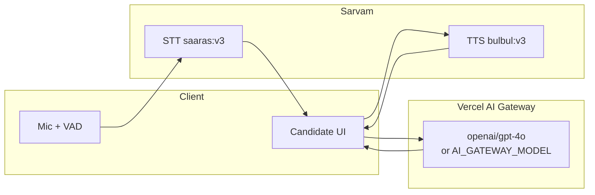
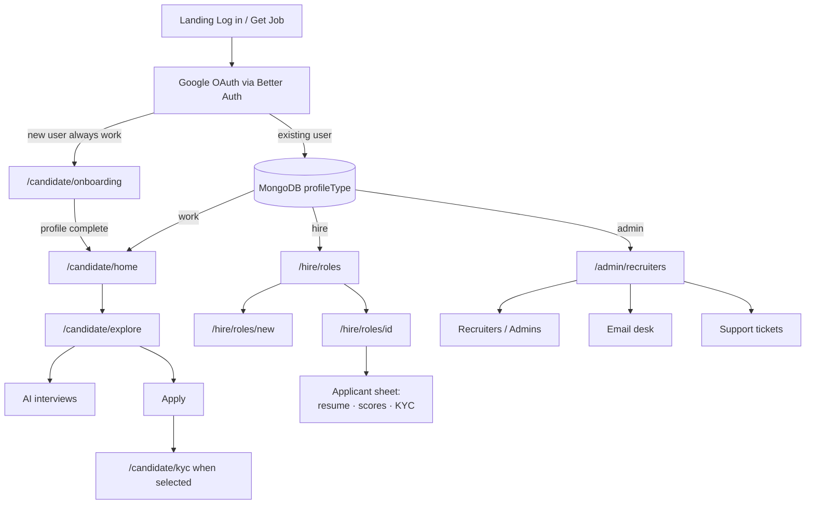
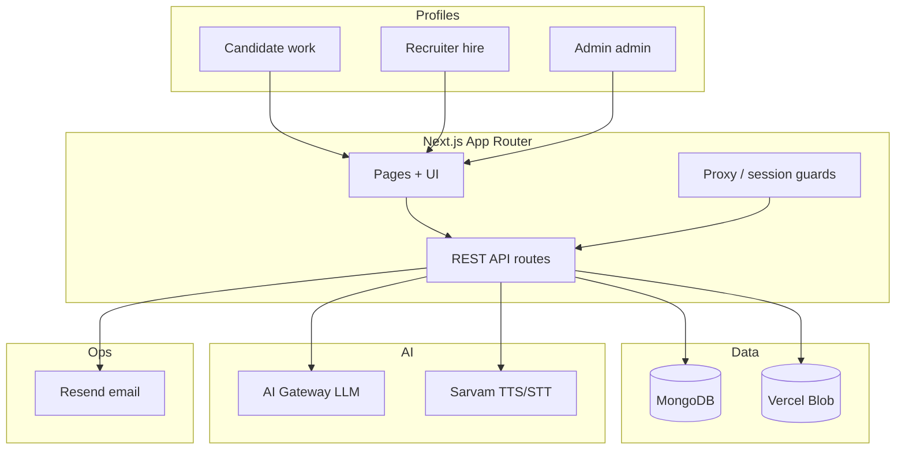
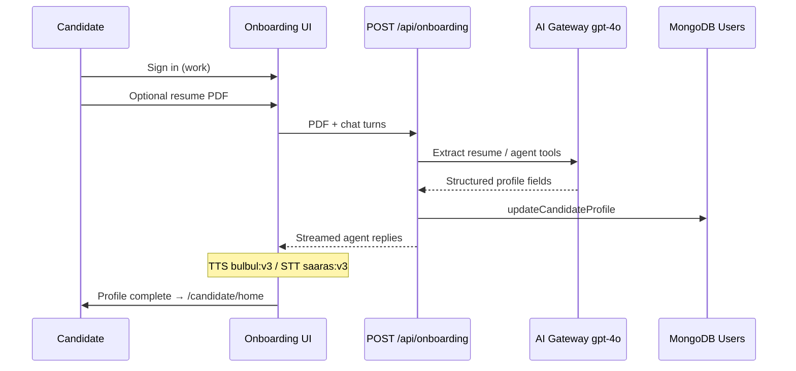
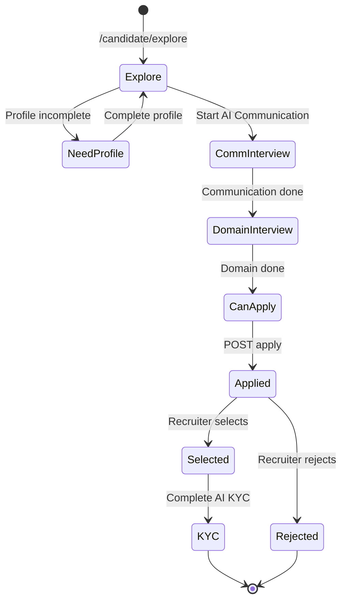
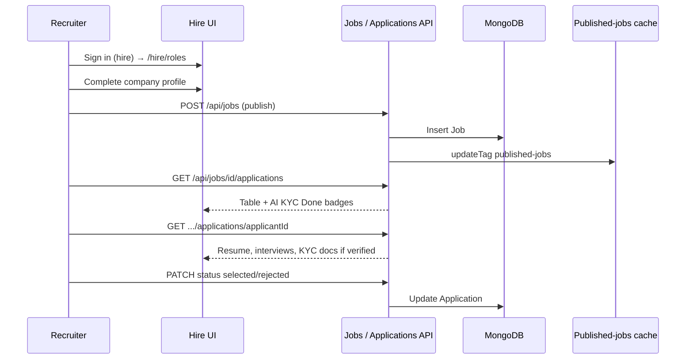
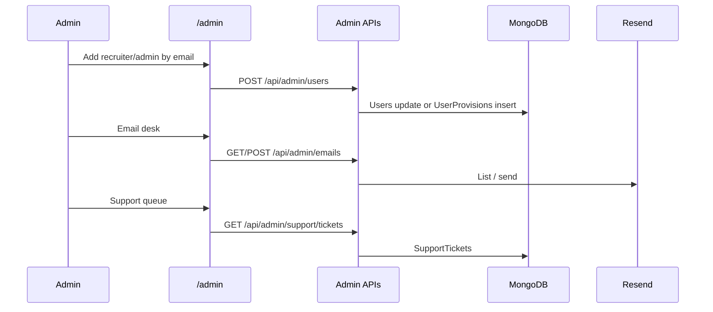
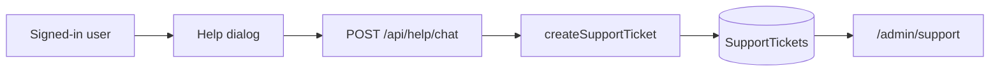
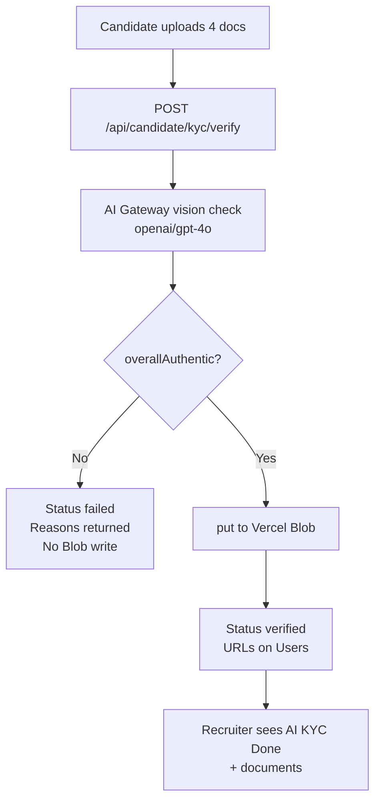
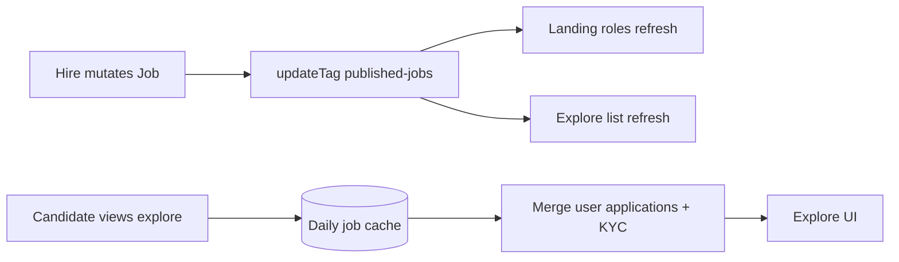

# Blucollarz

**AI-native hiring infrastructure for candidates and recruiters.**

Blucollarz connects skilled people with hiring teams through AI onboarding, resume building, communication & domain interviews, and KYC document checks — so recruiters get clearer signal, faster.

| | |
|---|---|
| **Candidates (`work`)** | Onboard, build a profile, explore roles, complete AI interviews, verify identity |
| **Recruiters (`hire`)** | Post roles, review scored applicants, select/reject, view verified KYC docs |
| **Admins (`admin`)** | Provision recruiters/admins, Resend email desk, support ticket queue |
| **Auth** | [Better Auth](https://www.better-auth.com/) + Google OAuth |
| **AI** | Vercel AI Gateway (default `openai/gpt-4o`) + Sarvam voice (TTS/STT) |

---

## Table of contents

- [Capabilities](#capabilities)
- [Models used per feature](#models-used-per-feature)
- [Profiles & points of view](#profiles--points-of-view)
- [System overview](#system-overview)
- [Candidate flows](#candidate-flows)
- [Recruiter flows](#recruiter-flows)
- [Admin flows](#admin-flows)
- [In-app Help & support tickets](#in-app-help--support-tickets)
- [KYC verification](#kyc-verification)
- [Caching & performance](#caching--performance)
- [Storage](#storage)
- [Tech stack](#tech-stack)
- [Getting started](#getting-started)
- [Environment variables](#environment-variables)

---

## Capabilities

### AI

| Capability | What it does |
|------------|--------------|
| **AI for onboarding** | Voice-guided agent that walks candidates through profile setup |
| **AI for creating the resume** | Extracts structured resume data from a PDF, then fills gaps via conversation |
| **AI for communication interview** | Scored interview on clarity, fluency, confidence, professionalism |
| **AI for domain profile interview** | Role-aware domain interview using the job overview, with scores & summary |
| **AI for KYC document verification** | Vision checks on Aadhaar (front/back), PAN, and passport for authenticity, deepfakes, and AI-generated / tampered documents — **Blob upload only after AI passes** |
| **In-app Help agent** | Signed-in product assistant (text/voice) that can open structured support tickets |

### Platform

| Capability | What it does |
|------------|--------------|
| **Caching for load management** | Published roles cached daily on landing + explore; invalidated when hirers publish/update/delete |
| **Optimised API calls** | Lean REST handlers, shared query helpers, slim projections — efficient client ↔ server traffic |
| **Secure auth (Better Auth)** | Google sign-in with profile-scoped access (`work` / `hire` / `admin`) |
| **Admin console** | Recruiters & admins provisioning, Resend email desk, support ticket queue |
| **User provisions** | Invite hire/admin by email before first Google login (applied on signup) |

---

## Models used per feature

All LLM features go through the **Vercel AI Gateway**. The model id is configurable:

```text
AI_GATEWAY_MODEL  →  defaults to  openai/gpt-4o
```

| Feature | Model / provider | How it’s used |
|---------|------------------|---------------|
| Candidate onboarding agent | `openai/gpt-4o` (or `AI_GATEWAY_MODEL`) | `ToolLoopAgent` — chat + tools to update profile |
| Resume / PDF → profile | same | `generateText` on PDF bytes → structured JSON → MongoDB |
| Communication interview (live chat) | same | `ToolLoopAgent` id `ai-communication-interview` |
| Communication interview (scoring) | same | `generateText` + structured `Output.object` scores |
| Domain interview (live chat) | same | `ToolLoopAgent` id `ai-domain-interview` (job overview context) |
| Domain interview (scoring) | same | same analysis pipeline, domain-tuned prompt |
| KYC document verification | same (vision / file) | `generateText` + `Output.object` on 4 documents |
| In-app Help / support tickets | same | `streamText` + `createSupportTicket` tool |
| **Text-to-speech (TTS)** | **Sarvam** `bulbul:v3` (speaker `priya`, `en-IN`) | Streams spoken agent replies |
| **Speech-to-text (STT)** | **Sarvam** `saaras:v3` | Transcribes candidate mic segments (VAD) |


```mermaid
flowchart LR
  subgraph Client
    UI[Candidate UI]
    Mic[Mic + VAD]
  end

  subgraph Voice["Sarvam"]
    STT["STT saaras:v3"]
    TTS["TTS bulbul:v3"]
  end

  subgraph Gateway["Vercel AI Gateway"]
    LLM["openai/gpt-4o<br/>or AI_GATEWAY_MODEL"]
  end

  Mic --> STT
  STT --> UI
  UI --> LLM
  LLM --> UI
  UI --> TTS
  TTS --> UI
```

---

## Profiles & points of view

Blucollarz has **three account types**. Google sign-in always creates a **`work`** (candidate) account. **`hire`** and **`admin`** are provisioned by an existing admin (or invite queue) — there is no public hire/admin signup CTA.

| Profile | Who | How you get it | Lands on |
|---------|-----|----------------|----------|
| **`work`** | Candidate | Any Google sign-in (landing / nav) | `/candidate/onboarding` → `/candidate/home` when complete |
| **`hire`** | Recruiter | Admin sets profile (or email invite in `UserProvisions`) | `/hire/roles` after Google login |
| **`admin`** | Platform admin | Same as hire — admin provisioning only | `/admin/recruiters` |


```mermaid
flowchart TD
  Landing[Landing Log in / Get Job]
  Google[Google OAuth via Better Auth]
  DB[(MongoDB profileType)]

  Landing --> Google
  Google -->|new user always work| Onboard["/candidate/onboarding"]
  Onboard -->|profile complete| Home["/candidate/home"]

  Google -->|existing user| DB
  DB -->|work| Home
  DB -->|hire| Roles["/hire/roles"]
  DB -->|admin| Admin["/admin/recruiters"]

  Home --> Explore["/candidate/explore"]
  Explore --> Interviews[AI interviews]
  Explore --> Apply[Apply]
  Apply --> KYC["/candidate/kyc when selected"]

  Roles --> NewRole["/hire/roles/new"]
  Roles --> Applicants["/hire/roles/id"]
  Applicants --> Sheet[Applicant sheet:<br/>resume · scores · KYC]

  Admin --> Recruiters[Recruiters / Admins]
  Admin --> Email[Email desk]
  Admin --> Support[Support tickets]
```

### Candidate POV

You are a worker looking for roles. You:

1. Sign in with Google (always candidate)
2. Finish AI onboarding (resume PDF optional + voice agent)
3. Explore published jobs
4. Complete **communication** then **domain** AI interviews for a role
5. Apply
6. If **selected**, complete **AI KYC** so recruiters can see verified docs

### Recruiter POV

You are a hiring team with provisioned access. You:

1. Sign in with Google after Blucollarz sets your account to **hire** in the database
2. Complete company profile
3. Create and publish roles
4. Review applicants: resume, interview scores, recordings, transcripts
5. **Select** or **Reject**
6. When a selected candidate finishes KYC — see **AI KYC Done** badge + documents

### Admin POV

You operate the platform. You:

1. Sign in with Google after your account is set to **admin**
2. Provision recruiters and admins by email (live users or pending invites)
3. Use the email desk (Resend) for outbound / inbound mail
4. Triage support tickets created by the in-app Help agent

---

## System overview


```mermaid
flowchart TB
  subgraph Profiles
    C[Candidate work]
    H[Recruiter hire]
    A[Admin admin]
  end

  subgraph App["Next.js App Router"]
    Pages[Pages + UI]
    API[REST API routes]
    Proxy[Proxy / session guards]
  end

  subgraph Data
    Mongo[(MongoDB)]
    Blob[(Vercel Blob)]
  end

  subgraph AIStack["AI"]
    GW[AI Gateway LLM]
    Sarvam[Sarvam TTS/STT]
  end

  subgraph Ops["Ops"]
    Resend[Resend email]
  end

  C --> Pages
  H --> Pages
  A --> Pages
  Pages --> API
  Proxy --> API
  API --> Mongo
  API --> Blob
  API --> GW
  API --> Sarvam
  API --> Resend
```

---

## Candidate flows

### 1. Onboarding + resume


```mermaid
sequenceDiagram
  participant U as Candidate
  participant UI as Onboarding UI
  participant API as POST /api/onboarding
  participant LLM as AI Gateway gpt-4o
  participant DB as MongoDB Users

  U->>UI: Sign in (work)
  U->>UI: Optional resume PDF
  UI->>API: PDF + chat turns
  API->>LLM: Extract resume / agent tools
  LLM-->>API: Structured profile fields
  API->>DB: updateCandidateProfile
  API-->>UI: Streamed agent replies
  Note over UI: TTS bulbul:v3 / STT saaras:v3
  UI->>U: Profile complete → /candidate/home
```

| Step | Detail |
|------|--------|
| Route | `/candidate/onboarding` |
| API | `POST /api/onboarding` |
| Status gate | `GET /api/candidate/onboarding-status` |
| Resume PDF | Parsed in memory — **not** stored in Blob |
| Voice | Sarvam STT + TTS around the agent |

### 2. Explore → interviews → apply


```mermaid
stateDiagram-v2
  [*] --> Explore: /candidate/explore
  Explore --> NeedProfile: Profile incomplete
  NeedProfile --> Explore: Complete profile

  Explore --> CommInterview: Start AI Communication
  CommInterview --> DomainInterview: Communication done
  DomainInterview --> CanApply: Domain done
  CanApply --> Applied: POST apply

  Applied --> Selected: Recruiter selects
  Applied --> Rejected: Recruiter rejects
  Selected --> KYC: Complete AI KYC
  KYC --> [*]
  Rejected --> [*]
```

| Stage | Route / API | Model |
|-------|-------------|--------|
| Explore published jobs | `/candidate/explore`, `GET /api/jobs` | — (cached list) |
| Start interview | `POST /api/interviews/start` | — |
| Live interview chat | `POST /api/interviews/[id]/chat` | `openai/gpt-4o` |
| Complete + score | `POST /api/interviews/[id]/complete` | `openai/gpt-4o` analysis |
| Apply | `POST /api/jobs/[id]/apply` | — |
| Screen recording | Blob `interviews/{id}/{ts}.webm` | — |

**Interview agents**

| Stage id | Agent id | Focus |
|----------|----------|--------|
| `ai-communication` | `ai-communication-interview` | Soft skills / communication |
| `ai-domain` | `ai-domain-interview` | Domain fit vs job overview |

Scores stored: overall, clarity, fluency, confidence, professionalism (+ summary, strengths, improvements).

### 3. Home dashboard

| Route | `/candidate/home` |
|-------|-------------------|
| Shows | All applications with status (`applied` / `selected` / `rejected`), interview progress, pay, applied date |
| Deep link | Opens explore with `?jobId=` for that role |

---

## Recruiter flows


```mermaid
sequenceDiagram
  participant R as Recruiter
  participant UI as Hire UI
  participant API as Jobs / Applications API
  participant DB as MongoDB
  participant Cache as Published-jobs cache

  R->>UI: Sign in (hire) → /hire/roles
  R->>UI: Complete company profile
  R->>API: POST /api/jobs (publish)
  API->>DB: Insert Job
  API->>Cache: updateTag published-jobs
  R->>API: GET /api/jobs/id/applications
  API-->>UI: Table + AI KYC Done badges
  R->>API: GET .../applications/applicantId
  API-->>UI: Resume, interviews, KYC docs if verified
  R->>API: PATCH status selected/rejected
  API->>DB: Update Application
```

| Flow | Route | APIs |
|------|-------|------|
| Company profile | `/hire/profile` | `GET/PATCH /api/hire/profile` |
| Roles list | `/hire/roles` | `GET /api/jobs?scope=mine` |
| Create role | `/hire/roles/new` | `POST /api/jobs` |
| Edit role | Role sheet | `GET/PATCH/DELETE /api/jobs/[id]` |
| Applicants table | `/hire/roles/[id]` | `GET /api/jobs/[id]/applications` |
| Applicant detail | Applicant sheet | `GET .../applications/[applicantId]` |
| Select / Reject | Sheet footer | `PATCH` status `selected` \| `rejected` |

When KYC is verified, recruiters see:

- **AI KYC Done** badge (table + sheet)
- Document previews / links (Aadhaar front/back, PAN, passport)
- AI verification summary

Documents are **not** exposed until `kycStatus === "verified"`.

---

## Admin flows

Admins use `/admin` (profile-type gated). Access is **`profileType === "admin"`** only — no email allowlist bypass.

| Area | Route | What it does |
|------|-------|--------------|
| Recruiters | `/admin/recruiters` | List hire users; add by email (existing user → set `hire`, or queue invite); make candidate |
| Admins | `/admin/admins` | Same for `admin` profile type |
| Email | `/admin/email` | Resend sending/receiving inbox, compose (rich text), reply — paginated (10/page) |
| Support | `/admin/support` | Tickets from Help: filters (profile type, priority, seriousness, status), transcript, status updates |

**Provisioning**

1. Admin enters an email on Recruiters or Admins.
2. If the user already exists → `profileType` is updated.
3. If not → a row is stored in `UserProvisions` and applied on first Google signup (`consumeUserProvision`).
4. Admins cannot change their own role.


```mermaid
sequenceDiagram
  participant A as Admin
  participant UI as /admin
  participant API as Admin APIs
  participant DB as MongoDB
  participant R as Resend

  A->>UI: Add recruiter/admin by email
  UI->>API: POST /api/admin/users
  API->>DB: Users update or UserProvisions insert
  A->>UI: Email desk
  UI->>API: GET/POST /api/admin/emails
  API->>R: List / send
  A->>UI: Support queue
  UI->>API: GET /api/admin/support/tickets
  API->>DB: SupportTickets
```

---

## In-app Help & support tickets

Signed-in users (work / hire / admin) open **Help** from the left rail (above Cookies). The agent:

1. Knows `profileType` from the session
2. Clarifies the problem and offers a ticket
3. Asks “anything else?” then calls `createSupportTicket`
4. Stores a `SupportTickets` document (`_id` = ticket id) with user id, email, profile type, transcript, summary, problem type, seriousness, priority, status

| | |
|---|---|
| UI | Help dialog in app chrome |
| API | `POST /api/help/chat` (`streamText` + tool) |
| Admin | `/admin/support` |
| Collection | `SupportTickets` |
| Public how-to | `/contact` (screenshots: `/images/support/1.png`, `2.png`) |


```mermaid
flowchart LR
  User[Signed-in user] --> Help[Help dialog]
  Help --> Chat[POST /api/help/chat]
  Chat --> Tool[createSupportTicket]
  Tool --> ST[(SupportTickets)]
  ST --> AdminUI["/admin/support"]
```

---

## KYC verification

**Order of operations (important):** AI first → Blob only on pass.


```mermaid
flowchart TD
  A[Candidate uploads 4 docs] --> B[POST /api/candidate/kyc/verify]
  B --> C[AI Gateway vision check<br/>openai/gpt-4o]
  C --> D{overallAuthentic?}
  D -->|No| E[Status failed<br/>Reasons returned<br/>No Blob write]
  D -->|Yes| F[put to Vercel Blob]
  F --> G[Status verified<br/>URLs on Users]
  G --> H[Recruiter sees AI KYC Done<br/>+ documents]
```

| Slot | Document |
|------|----------|
| `aadhaarFront` | Aadhaar — front |
| `aadhaarBack` | Aadhaar — back |
| `pan` | PAN card |
| `passport` | Passport |

Checks include: document present, looks authentic, likely AI-generated / tampered / deepfake signals, name consistency across docs.

| | |
|---|---|
| Candidate UI | `/candidate/kyc` |
| Status | `GET /api/candidate/kyc` |
| Verify | `POST /api/candidate/kyc/verify` |
| Blob path | `{DB_NAME}/kyc/{userId}/{slot}.{ext}` |

---

## Caching & performance

Published job listings are cached for **one day** to reduce DB load on high-traffic surfaces.

| | |
|---|---|
| Directive | `"use cache"` + `cacheLife("days")` |
| Tag | `published-jobs` |
| Landing | `getLatestPublishedRoles` |
| Explore | Cached job page; **per-user** apply / interview / KYC state layered outside the cache |
| Invalidate | `updateTag("published-jobs")` when a hire creates (published), updates, or deletes a role |


```mermaid
flowchart LR
  Req[Hire mutates Job] --> Tag[updateTag published-jobs]
  Tag --> Landing[Landing roles refresh]
  Tag --> Explore[Explore list refresh]
  Req2[Candidate views explore] --> Cache[(Daily job cache)]
  Cache --> Merge[Merge user applications + KYC]
  Merge --> UI[Explore UI]
```

---

## Storage

### MongoDB

| Collection | Purpose |
|------------|---------|
| `Users` | Auth user, `profileType`, candidate profile, hire company fields, KYC |
| `UserProvisions` | Pending hire/admin invites by email (consumed on Google signup) |
| `SupportTickets` | Help-agent tickets (transcript, summary, priority, status, …) |
| `Jobs` | Roles (draft / published / closed) |
| `Applications` | Candidate ↔ job + status |
| `Interviews` | Stage, transcript, analysis scores, `videoUrl` |

### Vercel Blob

| Asset | When stored |
|-------|-------------|
| KYC documents | **Only after** AI KYC passes |
| Interview recordings | After interview complete (client upload) |
| Onboarding resume PDF | **Never** — parsed in memory only |

Paths are rooted under `DB_NAME` for environment isolation.

---

## Tech stack

| Layer | Choice |
|-------|--------|
| Framework | Next.js 16 (App Router, Cache Components) + React 19 |
| Auth | Better Auth + Google OAuth |
| Database | MongoDB |
| AI | Vercel AI SDK + AI Gateway (`openai/gpt-4o` default) |
| Voice | Sarvam (`bulbul:v3` TTS, `saaras:v3` STT) |
| Files | Vercel Blob |
| UI | Tailwind CSS 4, Radix / shadcn, Motion, TipTap |
| Validation | Zod |
| Tooling | Bun, Biome, TypeScript, React Compiler |

---

## Getting started

```bash
bun install
bun dev
```

Open [http://localhost:3000](http://localhost:3000).

```bash
bun run build   # production build
bun start       # start production server
bun run lint    # Biome
```

---

## Environment variables

| Variable | Purpose |
|----------|---------|
| `BETTER_AUTH_URL` | Auth base URL |
| `GOOGLE_CLIENT_ID` / `GOOGLE_CLIENT_SECRET` | Google OAuth |
| `MONGODB_URI` / `DB_NAME` | Database |
| `AI_GATEWAY_MODEL` | Optional; default `openai/gpt-4o` |
| `SARVAM_API_KEY` | TTS + STT |
| `RESEND_API_KEY` (or `RESEND_API`) | Admin email desk |
| `RESEND_FROM_EMAIL` | From address for admin compose |
| Blob / AI Gateway secrets | As configured on Vercel |
| `NEXT_PUBLIC_SITE_URL` | Canonical site URL |

---

## Key routes (quick map)

### Candidate

| Path | Purpose |
|------|---------|
| `/candidate/onboarding` | AI onboarding + resume |
| `/candidate/home` | Applications dashboard |
| `/candidate/explore` | Jobs + interviews + apply |
| `/candidate/kyc` | AI KYC |
| `/candidate/profile` | Edit profile |
| `/candidate/settings` | Settings / delete account |

### Recruiter

| Path | Purpose |
|------|---------|
| `/hire/roles` | Role list |
| `/hire/roles/new` | Create role |
| `/hire/roles/[id]` | Applicants |
| `/hire/profile` | Company profile |
| `/hire/settings` | Settings |

### Admin

| Path | Purpose |
|------|---------|
| `/admin/recruiters` | Hire users + invites |
| `/admin/admins` | Admin users + invites |
| `/admin/email` | Resend inbox / compose |
| `/admin/support` | Support ticket queue |

### Marketing

| Path | Purpose |
|------|---------|
| `/` | Landing + latest roles |
| `/for-recruiters` | Recruiter program info + request access |
| `/contact` | How to use Help + contact channels |

---

## License

Private — All rights reserved.
