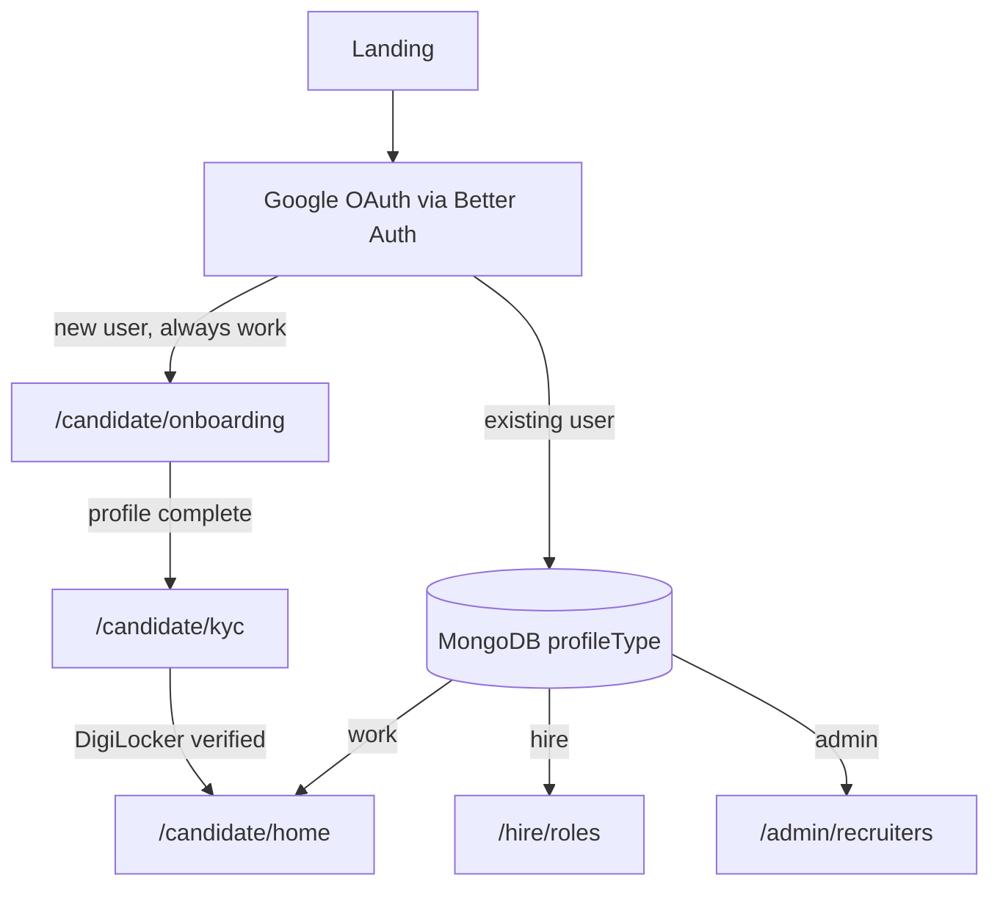
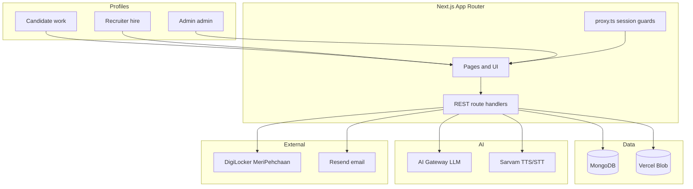
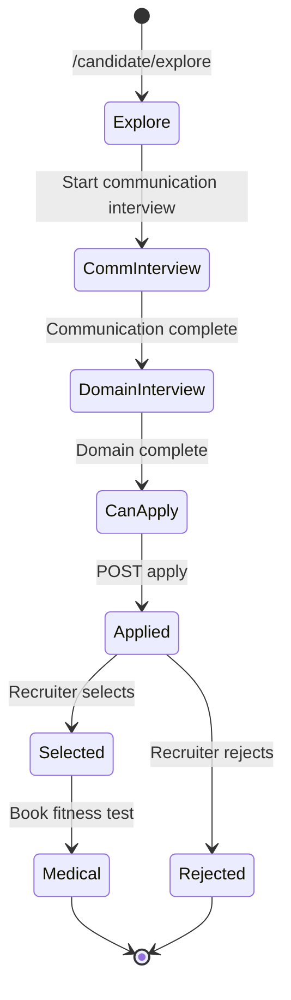
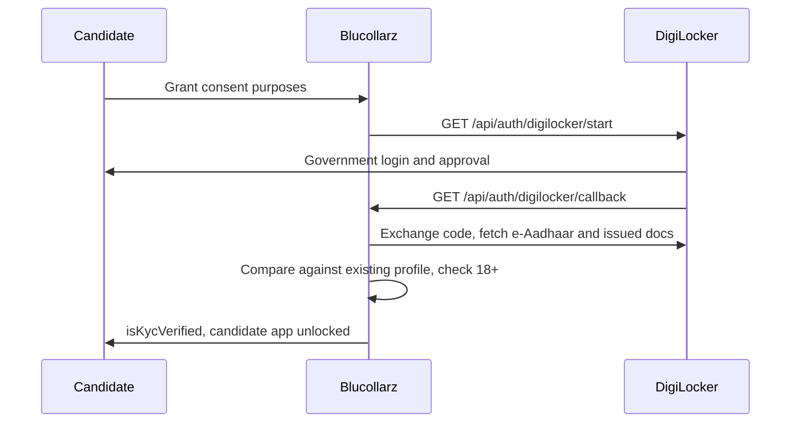
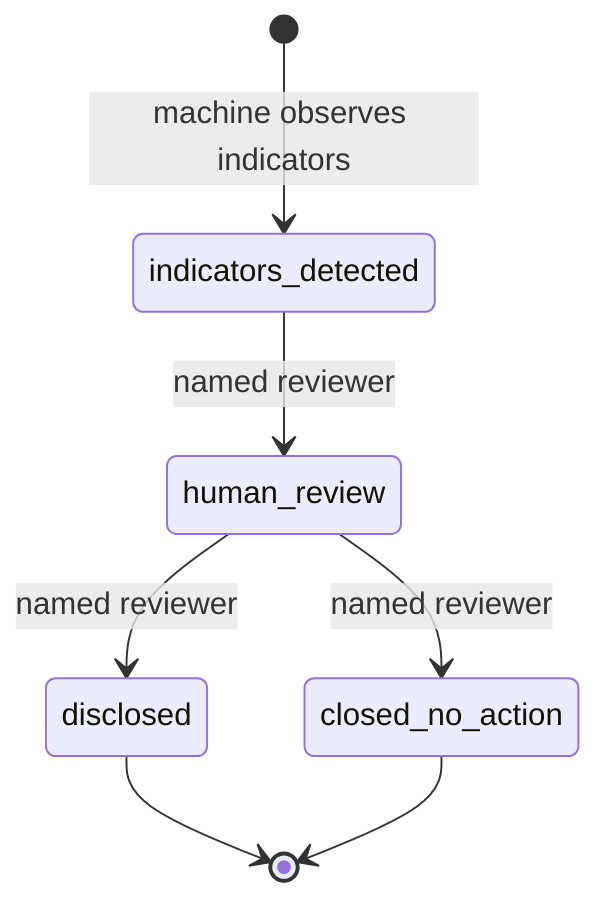

# Blucollarz

**AI-native hiring infrastructure for blue-collar workers and the teams that hire them.**

Blucollarz onboards workers through a voice-first AI agent, verifies identity through DigiLocker, runs AI interviews, and moves selected candidates through medical fitness checks — so recruiters get clearer signal without ever touching a worker's identity documents.

| | |
|---|---|
| **Candidates (`work`)** | Onboard by voice, verify via DigiLocker, explore roles, complete AI interviews, apply, book medical |
| **Recruiters (`hire`)** | Post roles, review scored applicants on a PII-scrubbed profile, select or reject |
| **Admins (`admin`)** | Provision recruiters, run the medical queue, handle DPDP rights and breaches, email desk, support, blog |
| **Auth** | [Better Auth](https://www.better-auth.com/) + Google OAuth |
| **AI** | Vercel AI Gateway (code default `openai/gpt-4o`) + Sarvam voice (TTS/STT) |

---

## Table of contents

- [Capabilities](#capabilities)
- [Profiles and access](#profiles-and-access)
- [System overview](#system-overview)
- [Candidate flow](#candidate-flow)
- [Recruiter flow](#recruiter-flow)
- [Admin console](#admin-console)
- [Identity verification (DigiLocker)](#identity-verification-digilocker)
- [Medical fitness](#medical-fitness)
- [Compliance (DPDP)](#compliance-dpdp)
- [Legal safety](#legal-safety)
- [AI models and features](#ai-models-and-features)
- [Storage](#storage)
- [Rate limits](#rate-limits)
- [API reference](#api-reference)
- [Tech stack](#tech-stack)
- [Getting started](#getting-started)
- [Environment variables](#environment-variables)
- [Testing](#testing)

---

## Capabilities

### AI

| Capability | What it does |
|---|---|
| **Onboarding agent** | Voice-guided `ToolLoopAgent` that fills the candidate profile through conversation |
| **Resume parsing** | Reads an uploaded PDF in memory and extracts structured profile fields. The PDF is never stored |
| **Communication interview** | Scored interview on clarity, fluency, confidence and professionalism |
| **Domain interview** | Role-aware interview that uses the job overview as context |
| **Job overview writer** | Drafts a role description for recruiters from a few structured inputs |
| **In-app help agent** | Signed-in assistant (text and voice) that can open structured support tickets |
| **Prohibited-output guard** | Blocks the model from making legal determinations, at runtime rather than by prompt |
| **Knowledge base RAG** | Admin uploads PDFs; they chunk, embed via the AI Gateway, and answer only from retrieved pages |

There is **no AI document verification**. Identity is established through DigiLocker, not by a model looking at photographs of documents.

### Platform

| Capability | What it does |
|---|---|
| **DigiLocker KYC** | Government-backed identity verification, required before the candidate app unlocks |
| **Medical fitness** | Center directory, slot booking, admin queue, and private fitness reports |
| **DPDP-oriented controls** | Purpose-scoped consent, data principal rights, breach register, legal holds. Not a Board certificate. See `docs/compliance/dpdp-and-emigrate.md` |
| **Private blob storage** | Interview recordings, medical reports and company documents are private and served through an authorizing proxy |
| **Published-jobs caching** | Landing and explore read a cached list, invalidated when a recruiter publishes or edits |
| **Rate limiting** | Shared per-user and global Sarvam caps on every AI and voice endpoint |
| **Admin console** | Recruiters, medical, compliance, email, support, blog, knowledge base, and settings |

---

## Profiles and access

Three account types. Google sign-in always creates a **`work`** (candidate) account. **`hire`** and **`admin`** are provisioned by an existing admin, or pre-seeded by email in `UserProvisions` and applied at first login. There is no public recruiter or admin signup.

| Profile | Who | How you get it | Lands on |
|---|---|---|---|
| **`work`** | Candidate | Any Google sign-in | `/candidate/onboarding` → `/candidate/kyc` → `/candidate/home` |
| **`hire`** | Recruiter | Admin sets the profile, or an email invite is applied at signup | `/hire/roles` |
| **`admin`** | Platform admin | Admin provisioning only | `/admin/recruiters` |

Session routing and the pre-app allowlist live in `src/proxy.ts`. Unauthenticated API calls get a JSON `401`; page requests get a redirect.


```mermaid
flowchart TD
  Landing[Landing] --> Google[Google OAuth via Better Auth]
  Google -->|new user, always work| Onboard["/candidate/onboarding"]
  Onboard -->|profile complete| Kyc["/candidate/kyc"]
  Kyc -->|DigiLocker verified| Home["/candidate/home"]

  Google -->|existing user| DB[(MongoDB profileType)]
  DB -->|work| Home
  DB -->|hire| Roles["/hire/roles"]
  DB -->|admin| Admin["/admin/recruiters"]
```

---

## System overview


```mermaid
flowchart TB
  subgraph Profiles
    C[Candidate work]
    H[Recruiter hire]
    A[Admin admin]
  end

  subgraph App["Next.js App Router"]
    Pages[Pages and UI]
    API[REST route handlers]
    Proxy[proxy.ts session guards]
  end

  subgraph Data
    Mongo[(MongoDB)]
    Blob[(Vercel Blob)]
  end

  subgraph AIStack["AI"]
    GW[AI Gateway LLM]
    Sarvam[Sarvam TTS/STT]
  end

  subgraph External
    DL[DigiLocker MeriPehchaan]
    Resend[Resend email]
  end

  C --> Pages
  H --> Pages
  A --> Pages
  Proxy --> Pages
  Pages --> API
  API --> Mongo
  API --> Blob
  API --> GW
  API --> Sarvam
  API --> DL
  API --> Resend
```

---

## Candidate flow

### 1. Onboarding

| | |
|---|---|
| Route | `/candidate/onboarding` |
| API | `POST /api/onboarding` |
| Status gate | `GET /api/candidate/onboarding-status` |
| Resume PDF | Parsed in memory, **not** stored |
| Voice | Sarvam STT and TTS wrapped around the agent |

On completion the agent redirects to `/candidate/kyc`.

### 2. Identity verification

The candidate app layout (`/candidate/home`, `/candidate/explore`, `/candidate/medical`, `/candidate/profile`) is gated on DigiLocker verification. See [Identity verification](#identity-verification-digilocker).

### 3. Explore, interview, apply


```mermaid
stateDiagram-v2
  [*] --> Explore: /candidate/explore
  Explore --> CommInterview: Start communication interview
  CommInterview --> DomainInterview: Communication complete
  DomainInterview --> CanApply: Domain complete
  CanApply --> Applied: POST apply
  Applied --> Selected: Recruiter selects
  Applied --> Rejected: Recruiter rejects
  Selected --> Medical: Book fitness test
  Medical --> [*]
  Rejected --> [*]
```

| Stage | Route or API |
|---|---|
| Explore published jobs | `/candidate/explore`, `GET /api/jobs` |
| Start interview | `POST /api/interviews/start` |
| Live interview chat | `POST /api/interviews/[id]/chat` |
| Complete and score | `POST /api/interviews/[id]/complete` |
| Custom written answers | `POST /api/interviews/[id]/custom-answers` |
| Apply | `POST /api/jobs/[id]/apply` |
| Screen recording | Private blob under `interviews/{interviewId}/` |

**Interview stages**

| Stage id | Agent id | Focus |
|---|---|---|
| `ai-communication` | `ai-communication-interview` | Communication and soft skills |
| `ai-domain` | `ai-domain-interview` | Domain fit against the job overview |

Scores stored per interview: overall, clarity, fluency, confidence, professionalism, plus summary, strengths and improvements.

Every candidate API that creates a real-world commitment — applying, interviewing, booking a medical — goes through `requireCandidateAppReady()`, which requires both a complete profile and DigiLocker verification, and returns a `KYC_REQUIRED` code when it fails.

---

## Recruiter flow

1. Sign in with Google after an admin sets the account to `hire`
2. Complete the company onboarding pack (`/hire/onboarding`)
3. Create and publish roles (`/hire/roles/new`), optionally drafting the overview with AI
4. Review applicants: resume, interview scores, recordings and transcripts
5. Select or reject

**Recruiters never see identity documents.** The applicant detail endpoint runs every profile through `toHireSafeProfile()` (`src/lib/compliance/arm.ts`), which strips email, phone, PAN, Aadhaar, date of birth and address. Interview recordings, transcripts and custom answers are released only when the candidate has granted evaluation consent.

---

## Admin console

Access requires `profileType === "admin"`. Nav is defined in `src/lib/core/routes.ts`.

| Section | Route | Contents |
|---|---|---|
| Recruiters | `/admin/recruiters` | Accounts, jobs, inquiries, company onboarding |
| Medical Test | `/admin/medical` | Candidate queue, centers |
| Compliance | `/admin/compliance` | Rights requests, breach register |
| Email | `/admin/email` | Resend outbound and inbound desk |
| Support | `/admin/support` | Ticket queue from the help agent |
| Blog | `/admin/blog` | Post authoring |
| Knowledge | `/admin/knowledge` | PDF ingest (background) and grounded Q&A |
| Settings | `/admin/settings` | Admin, voice, language model, grievance officer, system prompts, flow |

Legal-safety cases and legal holds are **API only** at present (`/api/admin/legal-safety/*`); there is no console page yet.

---

## Identity verification (DigiLocker)

Verification is an OAuth handshake with DigiLocker MeriPehchaan. No document images are uploaded, scored or stored.


```mermaid
sequenceDiagram
  participant U as Candidate
  participant App as Blucollarz
  participant DL as DigiLocker

  U->>App: Grant consent purposes
  App->>DL: GET /api/auth/digilocker/start
  DL->>U: Government login and approval
  DL->>App: GET /api/auth/digilocker/callback
  App->>DL: Exchange code, fetch e-Aadhaar and issued docs
  App->>App: Compare against existing profile, check 18+
  App->>U: isKycVerified, candidate app unlocked
```

| | |
|---|---|
| Provider | DigiLocker MeriPehchaan, `req_doctype: "ADHAR PANCR"` |
| Stored | `isKycVerified`, date of birth, name, phone, location, and `kyc: { provider, verifiedAt, aadhaarLast4, pan, gender }` |
| Not stored | Raw DigiLocker XML and JSON payloads |
| Checks | Date of birth, phone, PAN, Aadhaar last four and gender are compared against the existing profile; the candidate must be 18 or older |
| Consent | Requires the DigiLocker purpose bundle before the handshake starts |
| Routes | `/api/auth/digilocker/start`, `/callback`, `/status` |

---

## Medical fitness

Selected candidates book a fitness test; admins run the queue and upload the report.

**Candidate.** Must be selected on an application and must have granted the `medical` consent purpose. Books through `/candidate/medical` using `GET /api/candidate/medical-schedule`, `GET /api/candidate/medical-slots` and `POST /api/candidate/medical-appointments`, then reads results from `GET /api/candidate/medical-reports`.

**Admin.** Works the queue at `/admin/medical`: schedule and reschedule, mark no-show or unfit, and complete an appointment with fitness reports. Centers carry a licence, address and operating hours.

Appointment statuses are `scheduled`, `completed`, `cancelled`, `no_show` and `unfit`. Reports are private blobs; candidates and admins read them through the authorizing proxy. Withdrawing medical consent cancels any scheduled appointment.

---

## Compliance (DPDP)

This is **engineering toward** the Digital Personal Data Protection Act, 2023 and the DPDP Rules, 2025. Substantive notice, consent, rights, security, and breach duties in the Rules are scheduled to apply **13 May 2027**. The product is not DPDP-certified and is not eMigrate. Posture, gaps, and sources: `docs/compliance/dpdp-and-emigrate.md`.

Modules live in `src/lib/compliance/`.

| Module | Purpose |
|---|---|
| `consent.ts` | Append-only consent events, purpose-scoped. Notice version `1.4`. Grant requires a server `playbackId` |
| `rights.ts` | Data principal requests: access, correction, erasure, withdrawal, nomination, grievance |
| `breach.ts` | Personal data breach register |
| `legal-hold.ts` | Blocks erasure while material must be preserved |
| `grievance.ts` | Grievance officer contact, from settings with env fallback |
| `timelines.ts` | Acknowledgement and resolution deadlines |
| `arm.ts` | Strips PII before any employer-facing view |
| `analytics.ts` | Client-side analytics consent |

Consent purposes: `identity`, `contact`, `evaluation`, `medical`. All four are asked once before DigiLocker, each as its own switch. Passport, PCC, and educational certificates are not collected here.

Erasure is refused while a legal hold is active, which surfaces as a `409` with code `LEGAL_HOLD_ACTIVE`.

Supporting documents: `docs/compliance/dpdp-and-emigrate.md`, `candidate-journey.md` (cookie → onboarding → consent → KYC → interview → medical), `ropa.md`, `rights-sop.md`, `qa-checklist.md`, `legal-safety-architecture-feedback-v0.2.md`.

---

## Legal safety

`src/lib/legal-safety/` implements the Legal Safety Architecture. Its organising rule: **the machine reports observations, humans make determinations.**

| Module | Purpose |
|---|---|
| `registry.ts` | Typed claims registry. Every claim carries a legal status and a policy status, and code may only act on a claim marked `encodable` |
| `lexicon.ts` | Prohibited output patterns for PAD-0001 to PAD-0008, in English and Hindi |
| `guard-stream.ts` | Runtime guard over model output, applied to every streaming and generated worker-facing surface |
| `detect.ts` | Neutral BNS s.143 indicator detection over worker-authored text |
| `serious-offence.ts` | The case gate, its transitions and evidence preservation |
| `notices.ts` | Versioned POL-0007 and POL-0005 wording and delivery records |

**The guard is not a prompt.** Prompts are admin-editable at runtime and a model can be argued out of them, so enforcement runs after generation, releasing text one clause at a time so a violation is caught before the worker sees any of it.

**The gate.** Indicator detection is the only machine-initiated step; it opens a case at `indicators_detected` and immediately places a legal hold so material survives an erasure request made before a human has looked at it. Both onward transitions require a named reviewer, and the actor is always taken from the session rather than the request body.


```mermaid
stateDiagram-v2
  [*] --> indicators_detected: machine observes indicators
  indicators_detected --> human_review: named reviewer
  human_review --> disclosed: named reviewer
  human_review --> closed_no_action: named reviewer
  disclosed --> [*]
  closed_no_action --> [*]
```

**Notice wording is drafted, not approved.** Every delivery record carries `DRAFT-NOT-COUNSEL-APPROVED` and a version. Wording exists in English and Hindi only; a request in any other language fails closed and asks for human delivery rather than showing a serious-safety warning in a language the worker may not read. A delivery record is never a consent record.

---

## AI models and features

Every LLM call goes through the **Vercel AI Gateway**. Chat and embedding model ids are set in **Admin → Settings** and cached; code defaults when nothing is saved are `openai/gpt-4o` and `openai/text-embedding-3-small`. Model ids are not read from the environment.

| Feature | SDK call | Location |
|---|---|---|
| Candidate onboarding agent | `ToolLoopAgent` + `createAgentUIStreamResponse` | `api/onboarding` |
| Resume PDF to profile | `generateText` with a PDF part | `api/onboarding` |
| Profile summary | `generateText` | `api/onboarding` |
| Interview chat (both stages) | `ToolLoopAgent` + `createAgentUIStreamResponse` | `api/interviews/[id]/chat` |
| Interview scoring | `generateText` + `Output.object` | `lib/interviews/analysis.ts` |
| Job overview | `generateText` + `Output.object` | `api/hire/job-overview` |
| Help and support tickets | `streamText` + tool | `api/help/chat` |
| Knowledge base RAG | `streamText` + `searchDocuments` tool | `api/admin/knowledge/chat` |

**Voice** is Sarvam: TTS `bulbul:v3` (speaker `priya`, temperature `0.15`, pace `1`, mp3 128k) and STT `saaras:v3` in `transcribe` mode. Eleven Indian locales are supported for the spoken agent. Defaults are overridable in Admin → Settings except STT mode, which is locked to `transcribe`.

---

## Storage

Vercel Blob, with every path rooted under `DB_NAME`. Access is derived from the path family, never from the caller.

| Kind | Path | Access |
|---|---|---|
| `interview` | `{DB_NAME}/interviews/{interviewId}/…` | private |
| `medical` | `{DB_NAME}/admin/medical/{appointmentId}/…` | private |
| `company` | `{DB_NAME}/users/{userId}/company/…` | private |
| `blog` | `{DB_NAME}/admin/blog/…` | public |
| `email` | `{DB_NAME}/admin/email/…` | public |
| `knowledge` | `{DB_NAME}/admin/knowledge/…` | private |

Uploads go straight from the browser via `uploadBlob()` (`src/lib/blob/client/upload.ts`) using a token minted by `POST /api/blob/client/upload` (`src/lib/blob/server/upload.ts`), which enforces the allowed prefixes. Deletes use `deleteBlobUrls()` (`src/lib/blob/server/delete.ts`). Private files are read through `GET /api/blob/file?path=…` (`src/lib/blob/server/get.ts`), which authorizes the viewer before streaming: an interview is readable by its owner or by a hirer holding evaluation consent, a medical report by the candidate or an admin, a company document by its owner or an admin, a knowledge PDF by an admin.

### Knowledge base (Atlas Vector Search)

Admin **Knowledge** (`/admin/knowledge`) stores PDFs privately, then ingests them in the background (`after()` on `POST /api/admin/knowledge`):

1. Extract text per page (`unpdf`, fallback `pdf-parse`).
2. Chunk with LangChain `RecursiveCharacterTextSplitter` (~800 tokens, ~100 overlap).
3. Embed each chunk through the AI Gateway (embedding model from Admin → Settings).
4. Replace existing chunks for that filename (re-upload is idempotent).

Chunks live in Mongo `KnowledgeChunks` (`text`, `embedding`, `source`, `docType`, `page`, `chunkIndex`, `createdAt`). `ensureIndexes()` tries to create Atlas Vector Search index `knowledge_vector_index` (cosine, 1536 dims, filterable `docType` and `source`). If you are not on Atlas, or the index was created with different dimensions, create or update it in the Atlas UI:

- Index name: `knowledge_vector_index`
- Type: Vector Search
- Path: `embedding`, cosine, 1536 dimensions (must match `openai/text-embedding-3-small`; change both if you swap embedding models)
- Filter fields: `docType`, `source`

Ask tab streams answers from `POST /api/admin/knowledge/chat`. The model must call `searchDocuments` (`$vectorSearch`, top 5 by default, max 4 retrieval rounds) and cite `[filename p.N]`. Legal chunks always add that the output is not legal advice.

---

## Rate limits

Fixed 60-second windows in `src/lib/core/rate-limit.ts`, stored in Mongo (`RateLimits`) so every function instance shares the same counters. Exceeding a limit returns `429` with `Retry-After`.

| Route | Requests per minute |
|---|---|
| `voice/stt`, `voice/tts` | 90 per user |
| Sarvam STT / TTS (all users) | 600 global |
| `interviews/[id]/chat` | 40 |
| `onboarding` | 40 |
| `help/chat` | 20 |
| `admin/knowledge/chat` | 20 |
| `hire/job-overview` | 10 |
| `candidate/consent/playback` | 20 (counts toward global TTS) |

---

## API reference

### Auth
`/api/auth/[...all]` · `/api/auth/digilocker/start` · `/api/auth/digilocker/callback` · `/api/auth/digilocker/status`

### Candidate
| Route | Methods |
|---|---|
| `/api/candidate/profile` | GET, PUT |
| `/api/candidate/onboarding-status` | GET |
| `/api/candidate/voice-language` | POST |
| `/api/candidate/consent` | GET, POST |
| `/api/candidate/rights` | GET, POST |
| `/api/candidate/safety/notice` | GET, POST |
| `/api/candidate/medical-schedule` | GET |
| `/api/candidate/medical-slots` | GET |
| `/api/candidate/medical-appointments` | GET, POST |
| `/api/candidate/medical-reports` | GET |

### Jobs and interviews
| Route | Methods |
|---|---|
| `/api/jobs` | GET, POST |
| `/api/jobs/[id]` | GET, PATCH |
| `/api/jobs/[id]/apply` | POST |
| `/api/jobs/[id]/applications` | GET |
| `/api/jobs/[id]/applications/[applicantId]` | GET, PATCH |
| `/api/interviews/start` | POST |
| `/api/interviews/[id]/chat` | POST |
| `/api/interviews/[id]/complete` | POST |
| `/api/interviews/[id]/custom-answers` | POST |

Jobs are closed with `PATCH { action: "close" }`; there is no delete.

### Hire
`/api/hire/onboarding` (GET, PATCH) · `/api/hire/onboarding/submit` (POST) · `/api/hire/onboarding-status` (GET) · `/api/hire/job-overview` (POST)

### Admin
| Route | Methods |
|---|---|
| `/api/admin/users` | GET, POST, PATCH |
| `/api/admin/jobs`, `/api/admin/jobs/[id]` | GET / GET, PATCH |
| `/api/admin/recruiter-inquiries`, `/[id]` | GET / PATCH |
| `/api/admin/hire-onboardings`, `/[id]` | GET / PATCH |
| `/api/admin/medical/queue`, `/centers`, `/slots`, `/appointments`, `/complete` | see route files |
| `/api/admin/rights` | GET, PATCH |
| `/api/admin/breaches` | GET, POST, PATCH |
| `/api/admin/legal-safety/cases`, `/cases/[caseId]` | GET / PATCH |
| `/api/admin/support/tickets`, `/[id]`, `/[id]/reply` | GET, PATCH / GET / POST |
| `/api/admin/emails`, `/[id]` | GET, POST / GET |
| `/api/admin/blog`, `/[id]` | GET, POST, PATCH, DELETE / GET |
| `/api/admin/knowledge` | GET, POST |
| `/api/admin/knowledge/[id]` | POST (retry ingest), DELETE |
| `/api/admin/knowledge/chat` | POST |
| `/api/admin/settings` | GET, PATCH |

### Shared
`/api/onboarding` (POST) · `/api/help/chat` (POST) · `/api/voice/stt` (POST) · `/api/voice/tts` (GET health, POST stream) · `/api/blob/client/upload` (POST) · `/api/blob/file` (GET) · `/api/user/preferences` (GET, PATCH) · `/api/recruiter-inquiries` (POST)

---

## Tech stack

| Layer | Choice |
|---|---|
| Framework | Next.js 16 (App Router, Cache Components) with React 19 |
| Hosting | Vercel |
| Language | TypeScript 5 |
| Database | MongoDB 7 |
| Auth | Better Auth 1.6 with Google OAuth |
| AI | Vercel AI SDK 7 through the AI Gateway; Sarvam for voice |
| Storage | Vercel Blob 2 |
| Email | Resend 6 |
| Validation | Zod 4 |
| UI | Tailwind CSS 4, Base UI, Radix, shadcn, Lucide, TipTap, TanStack Table |
| Tooling | Biome 2 for lint and format, Bun for install and test |

---

## Getting started

```bash
bun install
cp .env.example .env.local   # then fill in the values below
bun dev
```

| Script | What it does |
|---|---|
| `bun dev` | Development server |
| `bun run build` | Production build |
| `bun start` | Serve the production build |
| `bun run lint` | Biome check |
| `bun run format` | Biome format and write |
| `bun run typecheck` | `tsc --noEmit` |
| `bun test` | Test suite |

---

## Environment variables

| Variable | Required | Used for |
|---|---|---|
| `MONGODB_URI` | yes | Database connection |
| `DB_NAME` | yes | Database name, and the blob path root |
| `BETTER_AUTH_URL` | yes | Auth and DigiLocker callback base URL |
| `BETTER_AUTH_SECRET` | yes | Session signing, and DigiLocker OAuth cookie sealing |
| `GOOGLE_CLIENT_ID` | yes | Google sign-in |
| `GOOGLE_CLIENT_SECRET` | yes | Google sign-in |
| `DIGILOCKER_CLIENT_ID` | yes | DigiLocker KYC |
| `DIGILOCKER_CLIENT_SECRET` | yes | DigiLocker KYC |
| `AI_GATEWAY_API_KEY` | yes | Vercel AI Gateway credentials |
| `BLOB_READ_WRITE_TOKEN` | yes | Private Vercel Blob store (interviews, medical, company docs, blog, email) |
| `SARVAM_API_KEY` | yes | Voice TTS and STT |
| `RESEND_API_KEY` | for email | Outbound mail. `RESEND_API` is accepted as an alias |
| `RESEND_FROM_EMAIL` | for email | Sender address |
| `NEXT_PUBLIC_SITE_URL` | for SEO | Sitemap and robots |
| `NEXT_PUBLIC_GOOGLE_ANALYTICS_ID` | optional | Analytics, consent-gated |
| `DPDP_GRIEVANCE_OFFICER_NAME` | optional | Fallback when settings are unset |
| `DPDP_GRIEVANCE_OFFICER_EMAIL` | optional | Fallback when settings are unset |
| `DPDP_GRIEVANCE_OFFICER_PHONE` | optional | Fallback when settings are unset |
| `DPDP_GRIEVANCE_OFFICER_ADDRESS` | optional | Fallback when settings are unset |
| `DPDP_GRIEVANCE_OFFICER_LANGUAGES` | optional | Fallback when settings are unset |
| `DPDP_RIGHTS_ACK_HOURS` | optional | Rights acknowledgement deadline |
| `DPDP_RIGHTS_RESOLVE_DAYS` | optional | Rights resolution deadline |

`AI_GATEWAY_API_KEY` is read by the Vercel AI SDK. `BLOB_READ_WRITE_TOKEN` is read in `src/lib/blob/server/token.ts` and passed into the Blob SDK.

---

## Testing

```bash
bun test                    # everything under test/
bun test test/legal-safety  # claims, PAD blocks, case gate, notices
```

Tests run on Bun's built-in runner. `bunfig.toml` preloads `test/setup.ts`, which stubs the `server-only` marker so server modules can be imported under test.

The legal-safety suite is the load-bearing one. It enforces that the claims registry stays internally consistent, that PAD-0001 through PAD-0008 are blocked in both English and Hindi, that permitted phrasing still gets through, that the case gate cannot be advanced without a named human, and that indicator detection never produces a conclusion.
