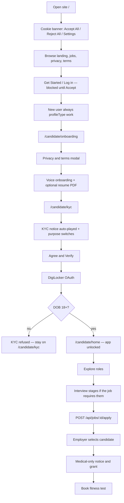

# Candidate journey — how the product actually works

**Audience:** a second reviewer (human or model) scoring this funnel out of 10.
**Scope:** public site → cookies → Google sign-in → terms dialogs → voice
onboarding → purpose consent → DigiLocker KYC → interviews → apply → medical.
**Date:** 18 Aug 2026. This is a **code walk**, not a legal opinion.

Do not score from marketing copy on `/` or `/about`. Score from the gates and
APIs below. If a step can be skipped in the UI, say so. If a notice is English
only, say so. Do not award 10/10: known caps are listed at the end.

Related: `docs/compliance/dpdp-and-emigrate.md` (DPDP / RA split),
`docs/compliance/ropa.md` (what is stored).

---

## 0. Public site (no account)

**Entry:** `/` (`src/app/(landing)/page.tsx`).

Chrome: landing nav + footer (`src/app/(landing)/layout.tsx`). Public routes
are listed in `src/proxy.ts` (`isPublicRoute`): `/`, `/about`, `/mission`,
`/vision`, `/for-recruiters`, `/contact`, `/privacy`, `/terms`, `/grievance`,
`/blog`, `/jobs/:id`, recruiter inquiry API, auth API, blob file proxy.

Hero CTA is **Get Started** (`DitherLoginButton`). Nav has **Log in**. Both
call `LoginButton` → `signInWithGoogle()`.

Public job listings exist. Applying from the signed-out site still requires
Google. There is no email/password signup. There is no public recruiter signup.

---

## 1. First-paint notice (every page)

**UI:** `CookieBanner` in the root layout (`src/app/layout.tsx`). Grok-style
dark bottom bar: **Cookies Settings**, **Reject All**, **Accept All Cookies**,
plus 18+ in the copy. Purpose consents still come later at KYC.

**Copy:**

> You must be 18 or older. Essential cookies keep the site working and stay on.
> Optional analytics help with performance — accept, reject, or manage them.
> We do not use advertising cookies. By clicking Accept All Cookies, you
> confirm you are 18 or older and agree to our Cookie Policy, Privacy Notice,
> and Terms of Service.

**Behaviour** (`src/components/compliance/cookie-banner.tsx`,
`src/lib/compliance/site-agreement.ts`, `src/lib/compliance/analytics.ts`):

| Action | What happens |
| --- | --- |
| Do nothing | Banner stays. `blucollarz_site_agreement` is unset. Log in / Get Started is blocked. Analytics script does **not** load. |
| **X** | Banner hides. Login stays blocked until they accept. Trying Log in re-opens the banner. |
| **Accept All Cookies** | Writes `agreed`. Covers Terms, Privacy, 18+, essential cookies, and turns analytics **on**. Log in / Get Started can run. |
| **Cookies Settings → Accept** | Same 18+ / Terms / Privacy / essential. Analytics only if the switch is on (starts off). |
| **Reject All** | Writes `declined`. Banner hides. Log in / Get Started stays blocked. If they were signed in, they are signed out. Trying Log in again re-opens the same banner. |
| After Google | Signed-in **Privacy & terms** modal records agreement on the user (`platformTermsAcceptedAt`). Not inferred from this banner. |
| Analytics later | Signed-in desktop rail: cookie icon → `PreferenceDialog`. PATCH `/api/user/preferences` `{ cookiesEnabled }`. |

18+ here is a **self-attestation**. KYC still rejects under-18 from DigiLocker
DOB.

**Not in this banner:** DPDP purpose consents (identity, contact, evaluation,
medical). Those are later, signed-in, purpose-scoped.

**Sidebar cookie:** shadcn sidebar open/closed is a separate UI cookie. It is
not analytics.

---

## 2. Google sign-in

`src/lib/auth/google-sign-in.ts`: Better Auth Google OAuth.
`callbackURL: "/candidate/onboarding"`. `errorCallbackURL: "/"`.

New Google users are always `profileType: "work"` (candidate). Hire and admin
are provisioned; they cannot self-serve that role (`src/lib/auth/auth.ts`,
`profileType.input: false`).

If a session cookie already exists and they hit `/`, `src/proxy.ts` sends:

- work + onboarding incomplete → `/candidate/onboarding`
- work + onboarded, KYC not verified → `/candidate/kyc`
- work + both done → `/candidate/home`
- hire incomplete → `/hire/onboarding`
- hire complete → `/hire/roles`

Google can still create a session **before** DigiLocker DOB is known. The
first-paint banner requires **Accept All Cookies** or **Cookies Settings →
Accept** (Terms, Privacy, 18+) before Log in / Get Started. Under-18 is still
refused at DigiLocker. Reject All blocks OAuth until they accept.

---

## 3. First-session dialogs (onboarding page, overlays)

Candidate chrome: `CandidateShell`
(`src/app/(software)/candidate/candidate-shell.tsx`).

Onboarding and KYC hide the mobile nav. Onboarding is full-bleed.

### 3.1 Privacy & terms modal (`PlatformTermsGate`)

Blocks the screen (`z-100`) until the **Users** document has
`platformTermsVersion === 1` and `platformTermsAcceptedAt` set.
Acceptance is **never** inferred from `localStorage`. Checkbox is required;
the button stays disabled until it is checked.

**Candidate copy (short):**

- This is a computer helper, not a person. I cannot give legal advice.
- What you say here is saved in your Blucollarz account so we can help you
  find work. You can ask us to show or delete your information.
- Links: Privacy Notice, Terms, Grievance. DigiLocker will ask for extra
  permission later.
- Checkbox: “I have read this. I agree to the Privacy Notice and Terms.”
- Button: **Okay, start** → `PATCH /api/user/preferences`
  `{ platformTermsAccepted: true }`.

There is **no Reject** on this modal. Closing without agreeing is not offered
(no close button). They can leave the site. They cannot use the voice agent
until this is saved.

This is **not** purpose consent (identity / medical / evaluation). It is
platform terms v1.

### 3.2 Safety notice (`SafetyNoticeGate`) — not consent

Only after terms are accepted, only `work` profiles.

Polls `/api/candidate/safety/status` every 8s. If `pol0005Required` (a
legal-review case is open), shows POL-0005 wording. Worker taps continue.
Code comments: **this is not a test, and it is not consent (POL-0006).**

If wording is missing in their voice language: “Someone will call you” /
Hindi equivalent; they can keep using the app.

POL-0005 remains **DRAFT-NOT-COUNSEL-APPROVED**. Do not score this as a
finished legal notice.

### 3.3 Help

In-app Help sits in the left rail above cookies (`HelpMenuButton`). Not part
of the first-run funnel. Worker text in help is still screened
(`screenWorkerTurnSafe`).

---

## 4. Voice onboarding (`/candidate/onboarding`)

**Page gate:** signed-in `work` only. If `candidateOnboardingComplete`,
redirect to KYC or home
(`src/app/(software)/candidate/onboarding/page.tsx`).

**UI:** `OnboardingAgent` (`src/components/candidate/onboarding-agent.tsx`).
**API:** `POST /api/onboarding` (`src/app/api/(software)/onboarding/route.ts`).
Rate-limited. Model output runs through `prohibitedOutputGuard` (PAD lexicon).
Each worker turn is screened (`screenWorkerTurnSafe`, source
`onboarding:{userId}`).

### 4.1 Microphone

Status starts: “Allow the microphone to begin.” CTA **START** until mic is
granted. Voice activity detection (VAD) captures speech → STT
(`transcribeBlob`) → chat. TTS speaks the assistant (`speakText`, Sarvam when
configured).

Without mic they cannot complete the voice path. There is no parallel
“type the whole profile instead” on this page. Later, `PUT /api/candidate/profile`
can patch fields but **cannot** flip `candidateOnboardingComplete` from
false → true (`403 ONBOARDING_REQUIRED`). Only the onboarding agent’s
`saveProfile` / `finishOnboarding` tools can complete the gate.

### 4.2 Language picker (in chat)

Tool `selectVoiceLanguage`. Prompt: “Which language should we use?”
Options (Sarvam locales): English, Hindi, Bengali, Gujarati, Kannada,
Malayalam, Marathi, Odia, Punjabi, Tamil, Telugu. Saved as
`profile.voiceLanguage`. Used later for interview TTS/STT and consent TTS
language (notice **text** is still English — see gaps).

### 4.3 Resume picker (in chat)

Tool `selectResume`. Optional PDF upload. Skills come from resume PDF only;
the coach is told not to ask for a professional summary (the model generates
it when interview fields are done).

### 4.4 What the coach collects (mandatory to complete)

`getMissingCandidateFields` (`src/lib/candidate/profile.ts`):

| Field | Meaning |
| --- | --- |
| `headline` | Currently working as |
| `yearsExperience` | Number, including 0 |
| `education` | At least one usable school/degree/major |
| `workExperience` | At least one usable company/role/description |
| `languages` | Spoken languages list |
| `summary` | Auto-written when the rest is done; min 40 chars |

**Deliberately not collected here:** phone, DOB, location, residence, PAN,
Aadhaar, gender. Prompt tells the model: DigiLocker fills identity after
onboarding. If KYC is already verified, those fields are stripped from
onboarding patches.

When interview fields are complete, `updateCandidateProfile` generates the
summary and `finishOnboarding` marks complete. Client then
`router.replace("/candidate/kyc")`. Status: “Profile complete — taking you
to KYC…”

### 4.5 Page / API lock after this

`src/proxy.ts` + `(app)/layout.tsx` + client `CandidateProgressGate`:

Incomplete onboarding → any `/candidate/*` except onboarding, kyc, settings
redirects to onboarding.

Settings is reachable during onboarding (withdraw/rights/cookies) without
unlocking Explore/Home.

---

## 5. KYC consent then DigiLocker (`/candidate/kyc`)

**Page gate:** onboarding must be complete; else redirect back to onboarding.

If not yet verified, the page is **only** `ConsentNoticePanel` variant `kyc`
(`src/components/candidate/kyc/kyc-verification.tsx`). Query
`?consent=required` shows: “Turn on every switch, then Agree and Verify.”

### 5.1 Notice (v1.4) — spoken + on screen

Official English string (`src/lib/compliance/consent-notices.ts` `KYC_NOTICE`):

> We verify you through DigiLocker. Employers see results, not your documents.
> Interviews may be recorded for a role you pursue. If an employer selects you,
> we book a fitness test and store the report. You pay nothing. You can view,
> fix, delete, or withdraw anytime. We never sell your data. You choose which
> of these you agree to.

This is the **one sitting** for every purpose this product uses. Passport, PCC,
and emigration clearance are not in this notice.

On KYC load the panel **auto-plays** the notice
(`POST /api/candidate/consent/playback` `{ scope: "kyc" }`). Server issues a
**single-use** `playbackId` (15 min TTL, collection `ConsentPlaybacks`),
header `X-Consent-Playback-Id`. Audio is Sarvam TTS of **that** string (or
browser `speechSynthesis` fallback with `en-IN` if no Sarvam key). Client
cannot grant with a homemade `voice_tap` flag.

**Grant rule:** `POST /api/candidate/consent` `{ action: "grant", purposes, playbackId }`.
Playback is consumed. Scopes are only `kyc` | `manage` (same spoken notice).
Empty purpose list → 400. DigiLocker still requires all four purposes live
(`DIGILOCKER_REQUIRED_PURPOSES` = `CONSENT_PURPOSES`).

### 5.2 Purpose switches (all must be ON for KYC)

All start **off**. Button **Agree and Verify** is disabled until every
visible switch is on.

| Purpose | Label on screen |
| --- | --- |
| `identity` | PAN, Aadhaar, Name — to confirm your identity |
| `contact` | Email & mobile — to contact you and secure your account |
| `evaluation` | AI interviews, transcripts, and optional recording — to evaluate you for a role |
| `medical` | Medical fitness test and its report — booked only after an employer selects you |

All four start **off**. Agree and Verify stays disabled until every switch is
on. Passport and PCC are **not** on this panel.

Also: **Ask me a question → OWRC 1800 11 3090** (tel: link). Not a consent.

After grant, browser goes to `verifyHref` = `/api/auth/digilocker/start`.

### 5.3 DigiLocker start / callback

`GET /api/auth/digilocker/start`:

- Must be onboarded, else redirect onboarding.
- Must have all DigiLocker purposes granted, else
  `/candidate/kyc?consent=required`.
- Sets encrypted OAuth cookie (state + PKCE). Redirects to MeriPehchaan.
  KYC payload is **not** stored in that cookie.

`GET /api/auth/digilocker/callback`:

- Re-checks onboarding + consent.
- Matches DigiLocker identity to the existing profile (phone, DOB, PAN,
  Aadhaar last 4, gender) — mismatch stays unverified with an error banner.
- Age: `isAtLeast18YearsOld`. Failure message: “You must be at least 18 years
  old to complete DigiLocker verification on Blucollarz”.
- Success: `isKycVerified: true`, name/DOB/phone/location/gender/PAN/Aadhaar
  last 4 saved. Shows verified card → **Continue** to `/candidate/home`.

Hirers never see identity documents. Hire views run `toHireSafeProfile`
(`src/lib/compliance/arm.ts`).

---

## 6. App unlocked

`(app)/layout.tsx` requires onboarding complete **and** `isKycVerified`.

Nav: Explore, Home, Profile, Settings.

**APIs that create real-world commitments** also call
`requireCandidateAppReady()` (same two gates), because the shell only
protects pages: apply, medical schedule / slots / appointments / reports.
Interview start/chat/complete also require live `evaluation` consent
(`requireInterviewEvaluationConsent`).

Cookie banner may still appear if they never chose on landing.

---

## 7. Interviews (Explore)

`src/components/work/explore-opportunities.tsx`.

Job may require stages: `ai-communication`, `ai-domain`, `custom-questions`
(from `applicationStepTemplates`). Apply is blocked until required stages
are completed (`POST /api/jobs/:id/apply` → `403 INTERVIEW_INCOMPLETE`).

`POST /api/interviews/start` needs app-ready **and** live `evaluation`
consent. That grant happens on the KYC panel before DigiLocker. Explore does
not show a second consent dialog. If they later withdraw evaluation, start
fails and they restore it in Settings.

### 7.1 Device / environment gate

Mobile AI interview: `InterviewDeviceGate` (“use a laptop”).

Desktop: `InterviewReadyPanel` checks internet, camera, microphone, AI
engine. Copy requires: quiet room, face on camera, **entire-screen share**,
no other person, no notes. Browser prompts for camera, mic, display capture.

### 7.2 Live interview

`AiInterview`: voice in/out, optional screen recording uploaded as a
**private** blob. Transcript stored. Worker turns screened. Model stream
guarded.

**Release to the hirer** of recordings/transcripts requires live
`evaluation` purpose (`INTERVIEW_RELEASE_REQUIRED_PURPOSES`). Withdraw
evaluation in Settings → hire sees withheld, not the files
(`hasGrantedPurposes` on applicant detail / blob proxy).

---

## 8. Apply

`POST /api/jobs/:id/apply`: app-ready + published job + required interviews
done. Idempotent application row. Employers see a hire-safe profile, not
Aadhaar/PAN/email/phone/DOB/address.

---

## 9. Medical (only after employer selects)

`/candidate/medical` (`CandidateMedicalScheduler`).

`GET /api/candidate/medical-schedule`: 404 “No selected role to schedule”
until the candidate is **selected** on an application. Not offered at KYC.

If `medicalConsent` is false (they withdrew in Settings), the page tells them
to turn it back on in Settings. There is no second consent panel or medical
notice. Re-grant happens on the same KYC notice in Settings.

Then center / date / slot → `POST /api/candidate/medical-appointments`. Server
`assertMedicalConsent` at booking **and** at report upload.

Statuses: `scheduled`, `completed`, `cancelled`, `no_show`, `unfit`.
Reports are private blobs; hire never gets the file. Admin medical queue
does.

Withdraw `medical` in Settings → `cancelScheduledMedicalOnWithdrawal`.

---

## 10. Settings (withdraw, rights, cookies)

`/candidate/settings` — allowed even before KYC.

- Appearance + app language.
- Privacy accordion: live `ConsentNoticePanel` compact (grant/withdraw any
  remaining purposes; same `KYC_NOTICE` as the DigiLocker sitting).
- Data rights: access, correction, erasure, withdraw, nominate, grievance
  (`DataRightsSection`). Withdraw label: “stops DigiLocker, hire release,
  interviews”.
- Delete account: blocked with `409 LEGAL_HOLD_ACTIVE` if a legal hold is on.

Cookie / notification toggles: left rail (`AppUserMenu`), not only Settings.

---

## 11. What this journey is not

- Not eMigrate and not a PGE Recruiting Agent. A licensed RA files
  clearance outside this app. See `docs/compliance/dpdp-and-emigrate.md`.
- Not recruiter onboarding (`/hire/onboarding` is a different company KYC
  flow).
- Not a Data Protection Board filing. Breach admin UI does not send the
  72-hour Board notice.

---

## 12. Caps a rater should apply (do not ignore)

Score the **implemented** funnel, then subtract for these. They are real.

1. **Recorded terms still after Google.** The first-paint accept is
   localStorage. The user-document Privacy & terms modal still runs after OAuth.
2. **Playback ≠ listened.** Auto-play issues a ticket; Agree can proceed
   without proving the audio finished. That is not DPDP s.6(10) proof.
3. **Notices are English.** Voice **locales** exist; Rule 3 / s.5 Eighth
   Schedule option for the notice itself is not shipped. TTS may speak
   English text in another locale’s voice.
4. **Short TTS notice is not a full itemised Rule 3 notice.** Long form is
   `/privacy`.
5. **No Reject on platform terms.** Only leave the site.
6. **Cookie choice is localStorage + account flag**, not a Consent Manager.
7. **Under-18 on the first-paint accept is self-attest; verifiable age only at DigiLocker.** A minor can still click Accept All. Google can still create a session before DOB is known.
8. **POL-0005 is draft.** Safety overlay is engineering, not counsel-approved
   law.

---

## 13. Code map

| Step | Where |
| --- | --- |
| Cookie banner | `src/components/compliance/cookie-banner.tsx` |
| Site agreement | `src/lib/compliance/site-agreement.ts` |
| GA gate | `src/components/compliance/analytics-scripts.tsx` |
| Public vs locked routes | `src/proxy.ts` |
| Google | `src/lib/auth/google-sign-in.ts` |
| Terms modal | `src/components/compliance/platform-terms-gate.tsx` |
| Safety overlay | `src/components/compliance/safety-notice-gate.tsx` |
| Voice onboarding UI | `src/components/candidate/onboarding-agent.tsx` |
| Onboarding API / tools | `src/app/api/(software)/onboarding/route.ts` |
| Complete-profile rules | `src/lib/candidate/profile.ts` |
| Profile PUT lock | `src/app/api/(software)/candidate/profile/route.ts` |
| Notice strings v1.4 | `src/lib/compliance/consent-notices.ts` |
| Consent ledger | `src/lib/compliance/consent.ts` |
| Playback tickets | `src/lib/compliance/consent-playback.ts` |
| Consent UI | `src/components/compliance/consent-notice-panel.tsx` |
| KYC page | `src/components/candidate/kyc/kyc-verification.tsx` |
| DigiLocker | `src/app/api/auth/digilocker/start/route.ts`, `callback/route.ts` |
| Age 18+ | `src/lib/kyc/apply-digilocker.ts` |
| App-ready API gate | `src/lib/auth/candidate-guard.ts` |
| Explore / apply / interview | `src/components/work/explore-opportunities.tsx` |
| Interview ready + live | `interview-ready-panel.tsx`, `ai-interview.tsx` |
| Medical UI | `src/components/candidate/medical/medical-scheduler.tsx` |
| Medical consent assert | `src/lib/medical/appointments.ts` `assertMedicalConsent` |
| Settings rights | `src/components/compliance/data-rights-section.tsx` |
| Tests | `test/compliance/`, `test/legal-safety/` |

When scoring, cite the step number and the file. Do not invent a cookie
wall, a parental-consent flow, an eMigrate step, or a medical grant at KYC —
none of those exist.
